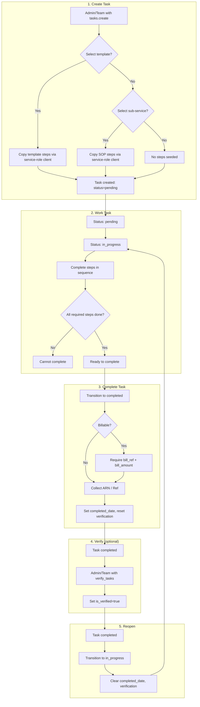
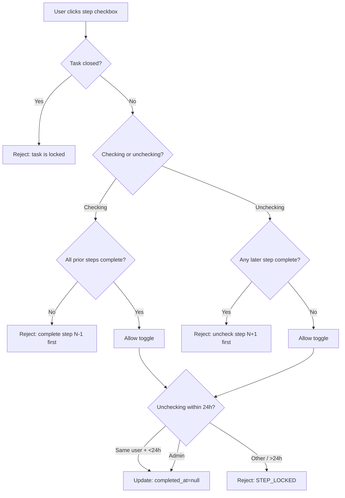
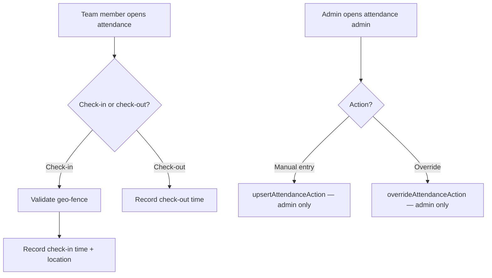

# System Flowchart — The Fiscal Fulcrum Portal

> Generated: 2026-05-20  
> Tool: Mermaid (view in any Markdown renderer that supports Mermaid)

---

## 1. Authentication & Role Routing

```mermaid
flowchart TD
    A[User visits /login] --> B{Authenticated?}
    B -->|No| C[Show login page]
    B -->|Yes| D[Redirect to /]
    D --> E{Role?}
    E -->|admin| F[/admin/dashboard]
    E -->|team| G[/team/dashboard]
    E -->|client| H[/portal/dashboard]
```

---

## 2. Task Lifecycle (Full)



---

## 3. Step Toggle Sequence Enforcement



---

## 4. Authorization Layers

```mermaid
flowchart LR
    subgraph Layer1["Layer 1: Middleware"]
        M1[Cookie session check]
        M2[Role prefix validation]
        M3[Portal module visibility]
    end

    subgraph Layer2["Layer 2: Server Action"]
        A1[requireRole]
        A2[requireCapability]
        A3[Zod validation]
    end

    subgraph Layer3["Layer 3: Service Logic"]
        S1[canModifyTask]
        S2[canCompleteTask]
        S3[canTransition]
        S4[Step sequence check]
    end

    subgraph Layer4["Layer 4: RLS"]
        R1[tasks_team_view]
        R2[task_steps_team]
        R3[task_activity_visible]
    end

    M1 --> M2 --> M3 --> A1 --> A2 --> A3 --> S1 --> S2 --> S3 --> S4 --> R1 --> R2 --> R3
```



---

## 5. Data Flow — Task Detail Page

```mermaid
flowchart TD
    U[User opens /team/tasks/:id] --> P[Page: team/tasks/[id]/page.tsx]
    P --> R1[repo: getTask]
    P --> R2[repo: getTaskSteps]
    P --> R3[repo: getTaskActivity]
    P --> R4[repo: getTaskNotes]
    P --> R5[repo: getWorkDone]
    P --> R6[repo: getTeamMembers]
    R1 --> N[Normalize FK arrays]
    R2 --> N
    N --> S[TaskDetailShell]
    S --> T1[Tabs: Steps]
    S --> T2[Tabs: Work Done]
    S --> T3[Tabs: Notes]
    S --> T4[Tabs: Overview]
    S --> T5[Tabs: Activity]
    S --> Sidebar[Sidebar: Details + Actions]
    T1 --> TaskStepsPanel
    Sidebar --> TaskActions
```

---

## 6. Attendance Flow



---

## 7. Billing / ARN Flow at Completion

```mermaid
flowchart TD
    B1[User selects "completed" transition] --> B2{Task billable?}
    B2 -->|Yes| B3[Show bill_ref + bill_amount inputs]
    B2 -->|No| B4[Hide billing inputs]
    B3 --> B5[User fills billing data]
    B4 --> B6[Show ARN / Ref input]
    B5 --> B6
    B6 --> B7[Show "client visible" checkbox]
    B7 --> B8[Submit transition]
    B8 --> B9{Validation}
    B9 -->|Missing billing| B10[Reject: BILLING_REQUIRED]
    B9 -->|Missing required steps| B11[Reject: STEPS_INCOMPLETE]
    B9 -->|Valid| B12[Save to tasks table]
    B12 --> B13[Display in Notes tab + Details sidebar]
```

---

*End of flowchart document.*
